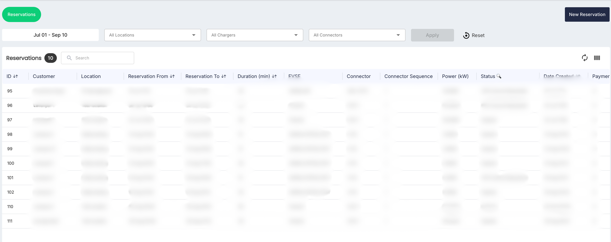
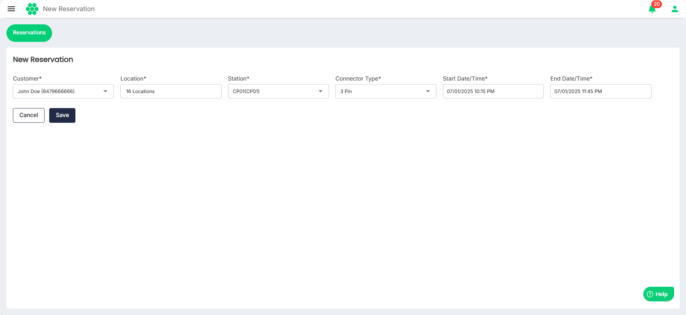

# Reservations

The Reservations module allows Charge Point Operators (CPOs) to view customer reservations and create new reservations on behalf of customers.
## Viewing Reservations
To view all the reservations in the system, navigate to **Reservations** > **Reservations**. The following screen appears that displays all reservations for a selected period:The displays details such as customer information, the location of the reservation, reservation date and time, charger details, and reservation status. You can easily filtered the data based on date range, location, chargers, or through a free text search. 
## Creating a New Reservation

As a CPO, you can create a new reservation on behalf of users by following these steps:

1. Click the **New Reservation** button. The New Reservation screen appears:
2. On the New Reservation screen, provide the following details: 
	- Customer
	- Location
	- Station
	- Connector Type
	- Start Date/Time
	- End Date/Time
1. Click the **Save** button.