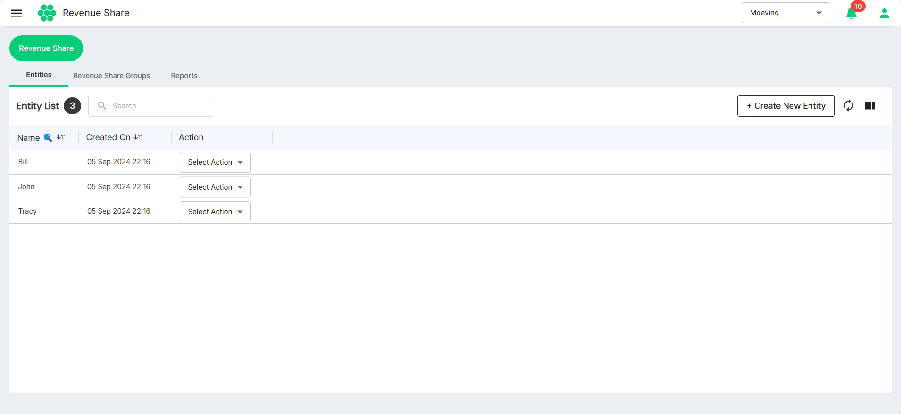
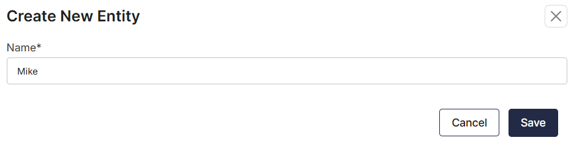
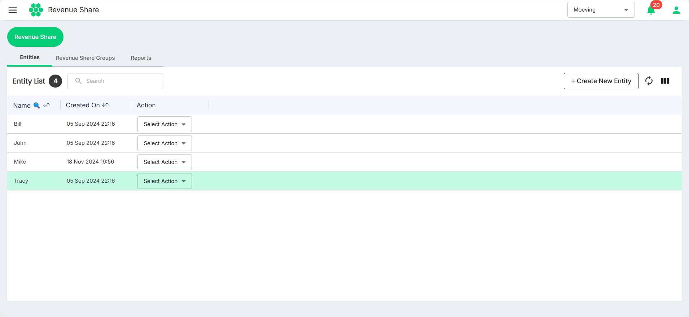
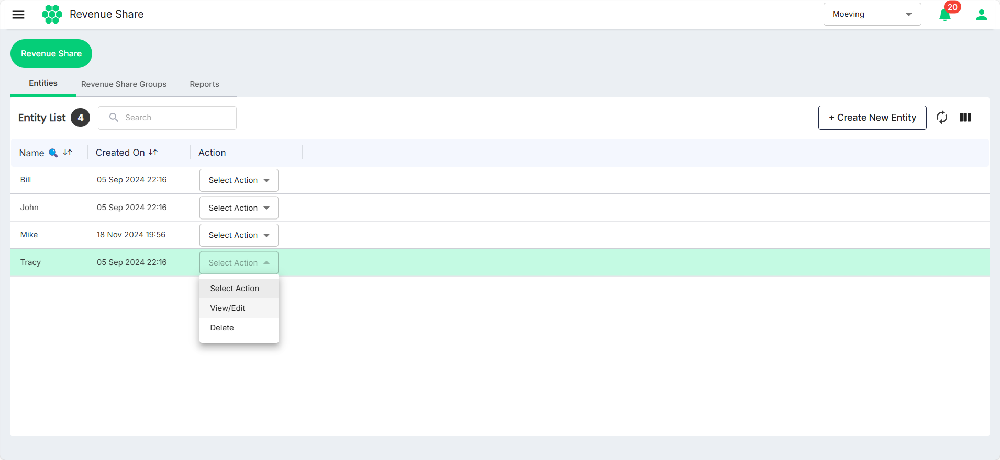

# Managing Entities
As part of managing entities, you can perform the following tasks:
- [Create Entity](#creating-entity)
- [Edit Entity](#editing-an-entity)
- [Delete Entity](#deleting-an-entity)
## Creating Entity
Before the revenue share is added in the HIEV dashboard, you must add the entities.

To do so, follow these steps:
1. Navigate to **Revenue Share** from the menu on the left.
   
2. Click on the **Create New Entity** button.
   
3. Enter the **Name** of the entity, and click **Save**. The new entity gets added under the Entities tab.

## Editing an Entity
To edit an entity, follow these steps:
1. Navigate to **Revenue Share** from the menu on the left.
   
2. Click on **View/Edit** option from the **Selection Action** drop-down list.
   
2. Make the desired changes.
3. Click **Save**.

## Deleting an Entity
To edit an entity, follow these steps:
1. Navigate to **Revenue Share** from the menu on the left.
   
2. Click on **Delete** option from the **Selection Action** drop-down list.
   
2. Click on **Delete** to confirm.
   