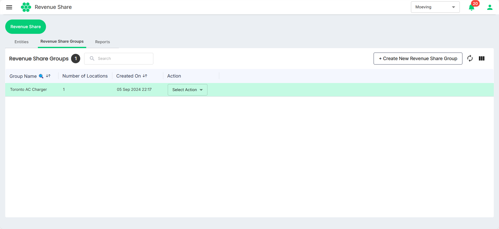
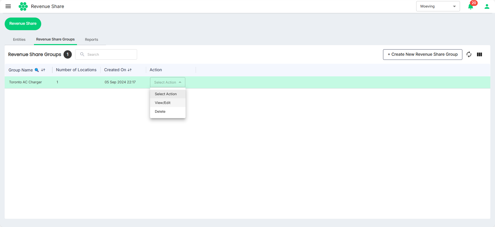
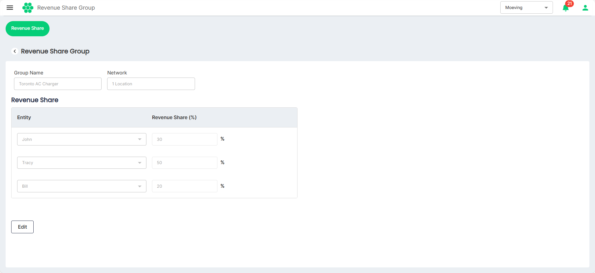
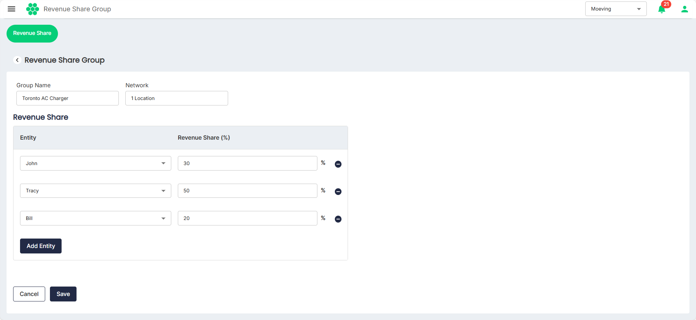
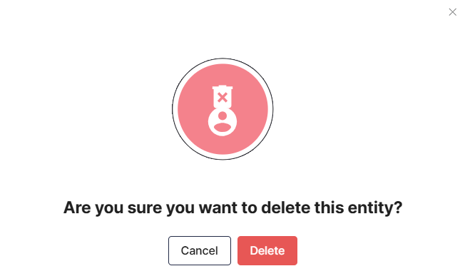

# Managing Revenue Share Groups
As part of managing Revenue Share Groups, you can perform the following tasks:
- [Create Revenue Share Group](#creating-a-revenue-share-group)
- [Edit Revenue Share Group](#creating-a-revenue-share-group)
- [Delete Revenue Share Group](#creating-a-revenue-share-group)

## Creating a Revenue Share Group
Revenue Share Groups allow station owners to define how revenue from charging sessions or networks is distributed among the [entities](ManagingEntities.md).

The HIEV platform offers flexible configurations, allowing owners to set specific percentages of revenue for each entity.

To create a Revenue Share Group, follow these steps:
1. Navigate to the **Revenue Share Groups** tab on the Revenue Share screen.
   
2. Click on the **Create New Revenue Share Group** button.
   
3. Enter the **Group Name** and select the locations from the **Select Network** drop-down list.
4. Select the entities from the drop-down lists and specify the revenue share percentage against each of them. Make sure that the sum of all the Revenue Share percentage is 100.
5. Click the **Save**.

## Editing a Revenue Share Group
To edit a Revenue Share Group, follow these steps:
1. Navigate to the **Revenue Share Groups** tab on the Revenue Share screen.
   
2. Click on **View/Edit** option from the **Selection Action** drop-down list.
   
3. Click the **Edit** button.
   
4. Make the desired changes.
   
5. Click **Save**.

## Deleting a Revenue Share Group
To delete a Revenue Share Group, follow these steps:
1. Navigate to the **Revenue Share Groups** tab on the Revenue Share screen.
   
2. Click on **Delete** option from the **Selection Action** drop-down list.
   
3. Click the **Delete** button from the window that appear.
   