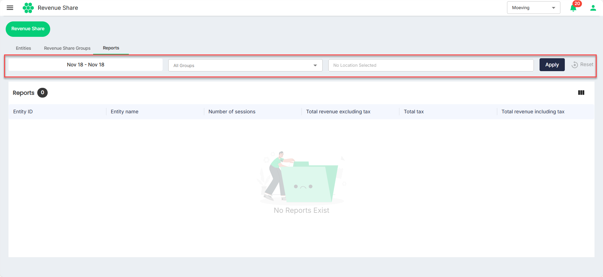

# Viewing Reports
The HIEV platform lets you view the revenue share reports from the past.

To view the repots, follow these steps:
1. Navigate to **Revenue Share** from the menu on the left.
    
2. Under the **Reports** tab, select the date range, revenue share groups, and locations. Then, click the **Apply** button.
  
The reports appears on the screen.