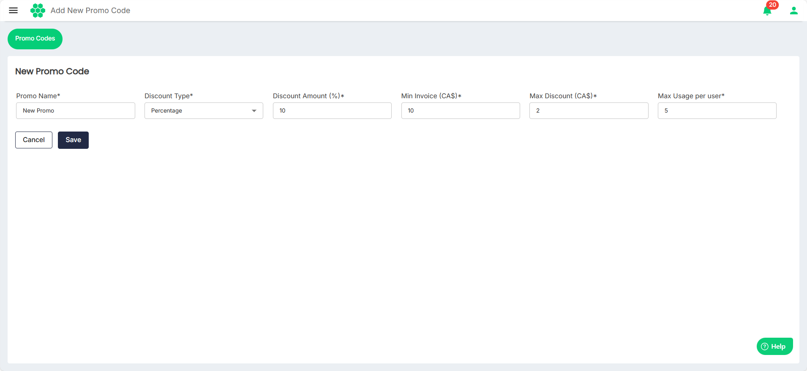

# Adding a New Promo Code
To add a new promo code, follow these steps:
Navigate to **Rewards** > **Add New Promo Code**. The New Promo Code screen appears.

- **Scenario 1**: When you want to provide a flat discount.
	- Enter the **Promo Name**.
	- Select **Flat** from the **Discount Type** drop-down list.
	- Enter the **Discount Amount**.
	- Enter the **Min Invoice** value on which the discount amount is applicable.
	- Enter the **Max Usage per user**, which is the maximum number of times for which the promo code can be used.

- **Scenario 2**: When you want to provide the discount as a percentage of the invoice value.
	- Enter the **Promo Name**.
	- Select **Percentage** from the **Discount Type** drop-down list.
	- Enter the **Discount Amount (%)**.
	- Enter the **Min Invoice** value on which the discount percentage amount is applicable.
	- Enter the **Max Discount** that can be given on the invoice.
	- Enter the **Max Usage per user**, which is the maximum number of times for which the promo code can be used.
 
Click **Save**.