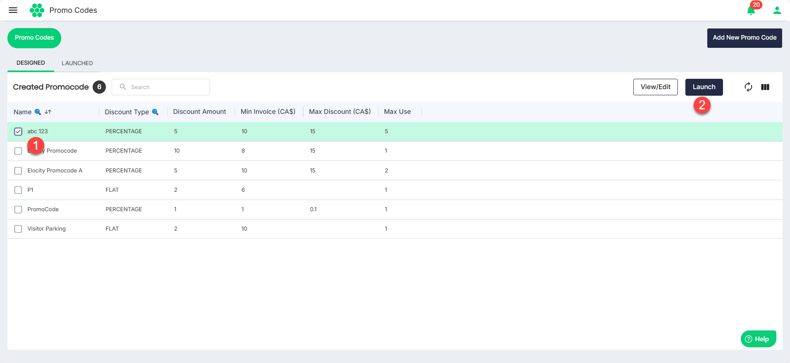

# Launching a Promo Code
Launching a promo code refers to introducing and making a specific promotional code available to users, enabling them to access discounts, offers, or special benefits.

To launch a promo code, follow these steps:
1. Select the promo code you want to launch from the **DESIGNED** tab.
2. Click the **Launch** button.
