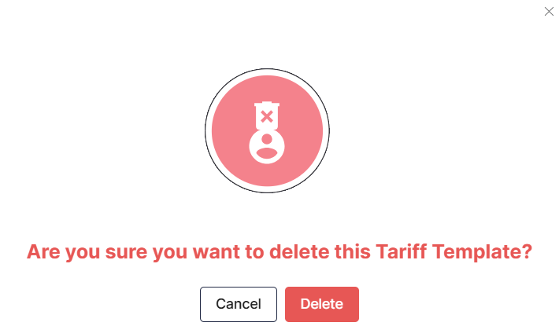

# Deleting Tariff Profile
To delete a tariff profile, follow these steps:
1. Navigate to **Tariff** > **Tariff Profiles**. The following screen appears:
   

3. Under Designed Tariff Profiles, select the tariff you want to delete.
4. Click the **View/Edit** button. The following screen appears:
   
2. Click the **Edit** button.
   
3. Click the **Delete** button. The following screen appears:
   
4. Click **Delete** to confirm.
