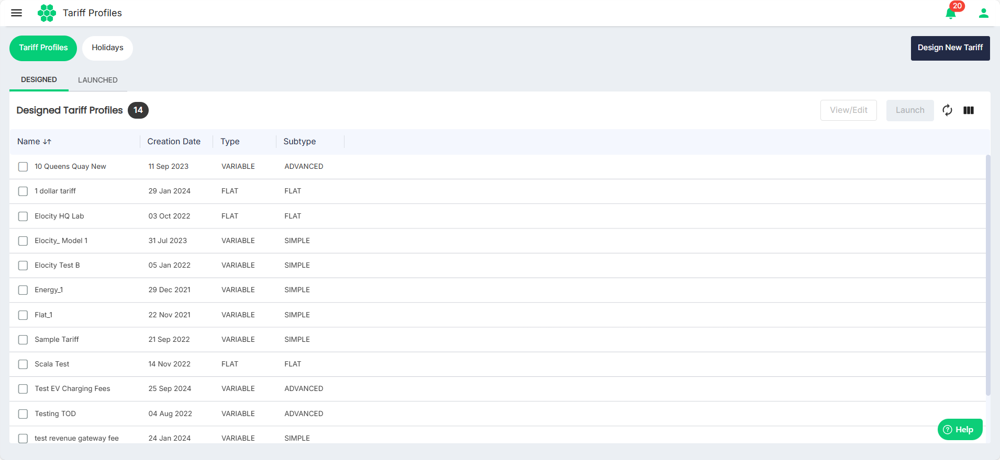
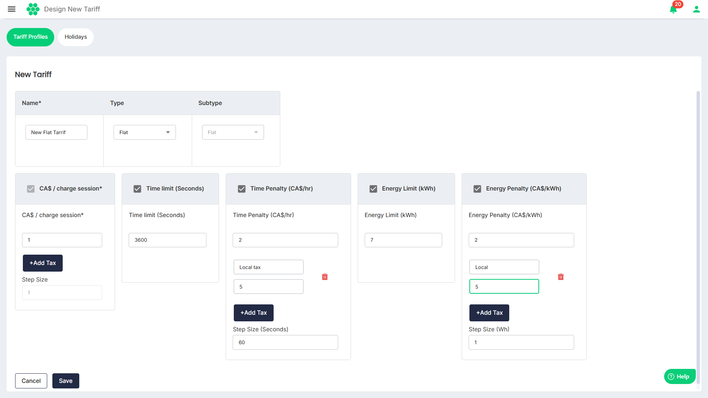
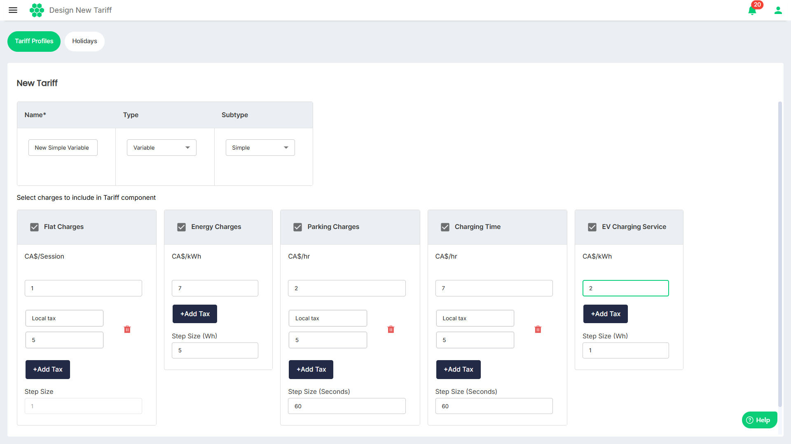
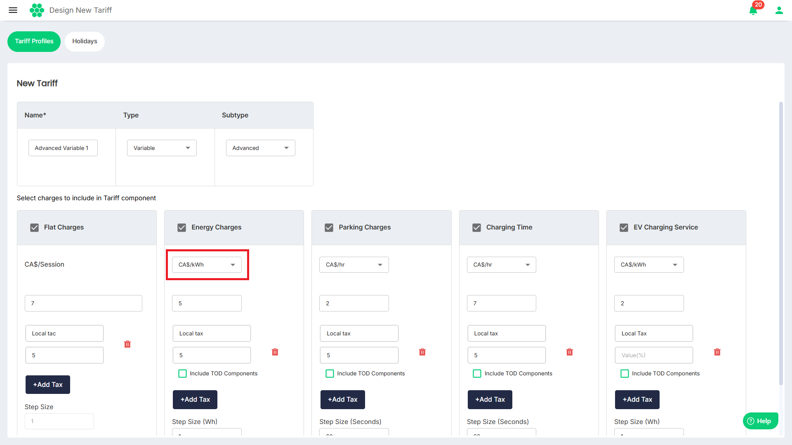
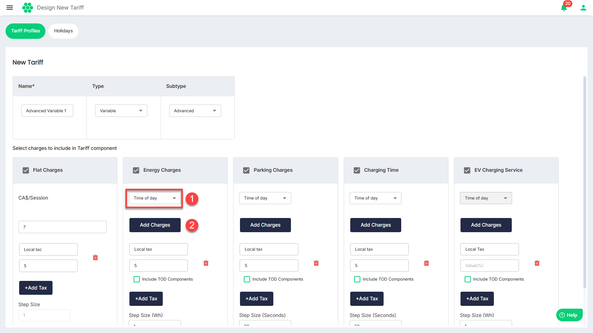
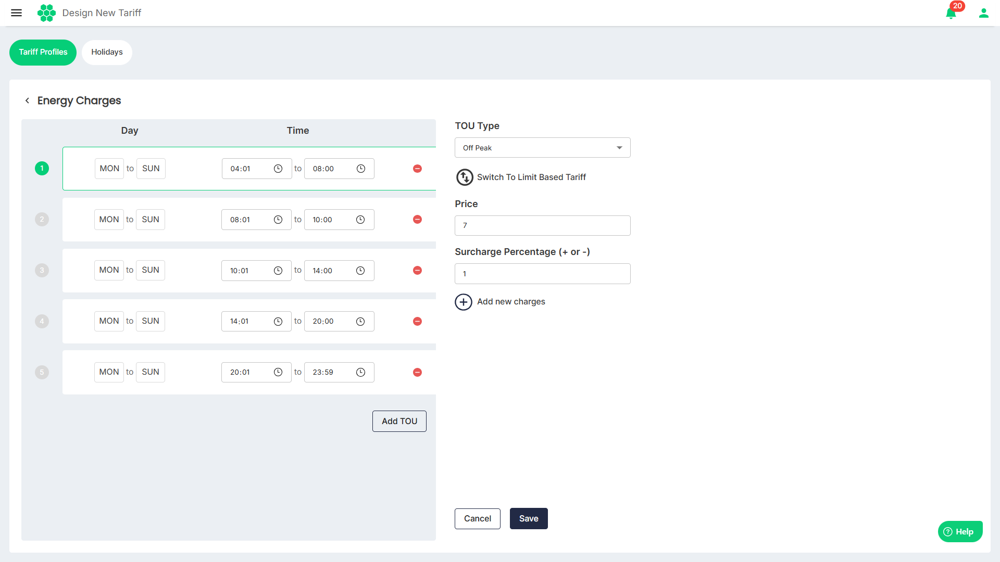
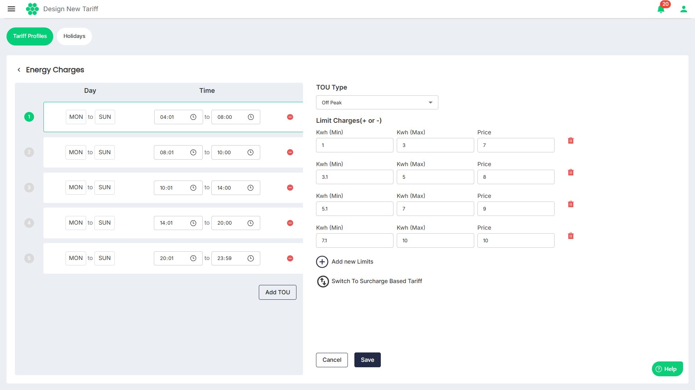

# Designing New Tariff Profile
The dashboard facilitates you in configuring the following types of tariffs and launching them.
- [Flat Tariff](#flat-tariff)
- [Variable Tariff](#variable-tariff)
## Flat Tariff

Flat Tariff option allow you to configure straightforward rates based on charging sessions. Additionally, you can add time and energy penalties if a charging session exceeds preset thresholds. 

To create a new flat tariff profile, follow these steps:
	1. Navigate to **Tariff** > **Tariff Profiles**. The following screen appears:
   

3. Click on the **Design New Tariff** button. The following screen appears:
   
3. Enter the **Name** using which you can identify this tariff at a later stage.
4. Select the **Flat** as the tariff **Type** from the drop-down list. 
5. Enter the tariff details:
	- **Rate/charge session:** Set fixed charges along with applicable taxes for each charging session. 
	- **Time Limit**: (Optional) Select this option and set the time limit for a charge session.
	- **Time Penalty:** (Optional) Set time penalties along with the applicable taxes and the **Step Size** if a charging session extends beyond specified time limits.
	- **Energy Limit**: (Optional) Select this option to set the energy consumption limit for a charge session.
	- **Energy Penalty:** (Optional) Set penalties along with applicable taxes **Step Size** for sessions exceeding predefined energy consumption limits, encouraging efficient use of charging resources.
	:::note
	**Step Size** refers to breaking down the total charge/energy consumed into smaller increments based on time or usage. For example, if the total cost for one hour is 7 CAD, the charge increases gradually, step by step, for each minute—approximately 0.1167 CAD per minute. If one kWh of energy is consumed in one hour, the consumption is divided into steps of 1 minute—approximately 0.0167 kWh per minute. This ensures that the billing is fair and proportional to the exact duration of use, rather than charging a flat rate upfront. 
	:::
1. Click **Save**.

## Variable Tariff

The Variable Tariff option offers more advanced configurations, providing a range of settings to meet tariff setting requirements. 

The Variable tariff is of following types:
- [Simple](#simple-variable-tariff)
- [Advanced](#advanced-variable-tariff)

### Simple Variable Tariff

To create a simple variable tariff profile, follow these steps:
	1. Navigate to **Tariff** > **Tariff Profiles**. The following screen appears:
   

3. Click on the **Design New Tariff** button. The following screen appears:
   
3. Enter the **Name** using which you can identify this tariff at a later stage.
4. Select the **Variable** as the tariff **Type** from the drop-down list. 
5. Select **Simple** as the **Subtype** from the drop-down list.
6. Select and provide inputs for one or more of the following tariff details:
	- **Flat Charges**: Set fixed charges along with applicable taxes for each charging session. 
	- **Energy Charges**: Set charges per kWh along with applicable taxes and **Step Size**.
	- **Parking Charges:** Set charges per hour along with applicable taxes and **Step Size** for the duration a vehicle is parked at the charging station.
	- **Charging Time**: Set charges per hour along with applicable taxes and **Step Size**.
	- **EV Charging Services:** Set additional charges along with applicable taxes and **Step Size** related to specific EV charging services, providing a tailored and versatile tariff structure.
	:::note
	**Step Size** refers to breaking down the total charge/energy consumed into smaller increments based on time or usage. For example, if the total cost for one hour is 7 CAD, the charge increases gradually, step by step, for each minute—approximately 0.1167 CAD per minute. If one kWh of energy is consumed in one hour, the consumption is divided into steps of 1 minute—approximately 0.0167 kWh per minute. This ensures that the billing is fair and proportional to the exact duration of use, rather than charging a flat rate upfront. 
	:::
### Advanced Variable Tariff
To create a advanced variable tariff profile, follow these steps:
	1. Navigate to **Tariff** > **Tariff Profiles**. The following screen appears:
   

3. Click on the **Design New Tariff** button.
4. Enter the **Name** using which you can identify this tariff at a later stage.
5. Select the **Variable** as the tariff **Type** from the drop-down list. 
6. Select **Advanced** as the **Subtype** from the drop-down list.
7. Select and provide inputs for one or more of the following tariff details:
	#### Tariff Based on Cost 
	
		- **Flat Charges**: Set fixed charges along with applicable taxes for each charging session. 
		- **Energy Charges**: Set energy charges along with applicable taxes  and **Step Size**.
		- **Parking Charges:** Set charges based along with applicable taxes  and **Step Size** on the duration a vehicle occupies the charging station.
		- **Charging Time:** Set charges along with applicable taxes  and **Step Size** that vary depending on the time of day, allowing for optimized pricing during off-peak and peak hours.
		- **EV Charging Services:** Set additional charges along with applicable taxes  and **Step Size** related to specific EV charging services.

	:::note
	**Step Size** refers to breaking down the total charge/energy consumed into smaller increments based on time or usage. For example, if the total cost for one hour is 7 CAD, the charge increases gradually, step by step, for each minute—approximately 0.1167 CAD per minute. If one kWh of energy is consumed in one hour, the consumption is divided into steps of 1 minute—approximately 0.0167 kWh per minute. This ensures that the billing is fair and proportional to the exact duration of use, rather than charging a flat rate upfront. 
	:::

	#### Tariff Based on Time of Day
	Select (1) **Time of day** from the drop-down list and then (2) click on the **Add Charges** button. The following screen appears where you can specify Surcharge Based Tariff profile at the most granular level:
	
	
	1. **Day** and **Time**: Set the **Day** and **Time** (together called Time of Use (**TOU**)) for creating a tariff. Click on the **Add TOU** button to add additional time slots so that all the days of the week and all the hours of a day are accounted for.

	1. **TOU Type**: Select **Off Peak**, **Mid Peak**, or **On Peak** from the drop-down list.
	2. **Price**: Set charges for the specified TOU.
	3. **Surcharge Percentage (+ or -)**: Add the surcharge (can be in positive or negative).
	4. **Add new charges**: Allows for additional charges related to specific EV charging services, providing a tailored and versatile tariff structure.
	5. Click **Save**.
	
	To specify Limit Based Tariff, click on **Switch to Limit Based Tariff**. The following screen appears:
	1. Specify **Kwh (Min)**, **Kwh (Max)**, and **Price**.
	2. Click on **Add new Limits** to add additional limits as shown in the image above.
	3. Click **Save**.
:::note
You may contact your account manager for assistance in designing tariff profiles that align with your specific requirements. The account manager provide personalized support, ensuring that the tariff configuration meets the unique needs of the charging infrastructure and users.
:::
