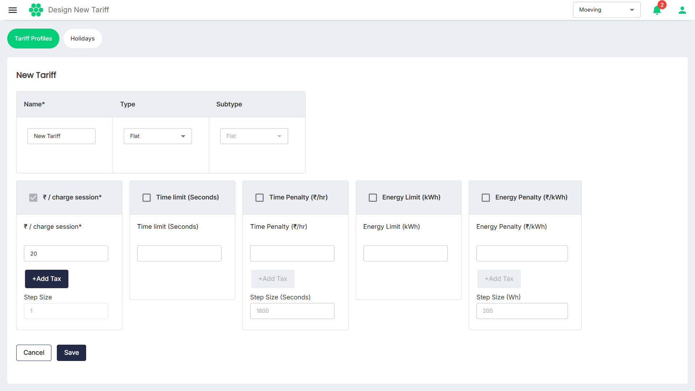

# Designing New Tariff Profile
The dashboard facilitates you in configuring the following types of tariffs and launching them.
- [Flat Tariff](#flat-tariff)
- [Variable Tariff](#variable-tariff)
## Flat Tariff

Flat Tariff option allow you to configure straightforward rates based on charging sessions. Additionally, you can add energy and time penalties if a charging session exceeds preset thresholds. The following are the key elements:

- **Flat Rates:** Set fixed charges for each charging session, providing simplicity and predictability for users.
- **Energy Penalty:** Configure penalties for sessions exceeding predefined energy consumption limits, encouraging efficient use of charging resources.
- **Time Penalty:** Apply time penalties to incentivize prompt utilization of charging stations for charging sessions that extend beyond specified time limits.
## Variable Tariff

The Variable Tariff option offers more advanced configurations, providing a range of settings to meet tariff setting requirements. This includes charges based on:

- **Time of Use:** Configure rates that vary depending on the time of day, allowing for optimized pricing during off-peak and peak hours.
- **Parking Charges:** Set charges based on the duration a vehicle occupies the charging station, encouraging turnover and efficient use of parking spaces.
- **EV Charging Services:** Allows for additional charges related to specific EV charging services, providing a tailored and versatile tariff structure.

:::note
You may contact your account manager for assistance in designing tariff profiles that align with your specific requirements. The account manager provide personalized support, ensuring that the tariff configuration meets the unique needs of the charging infrastructure and users.
:::

To create a new tariff profile, follow these steps:
	1. Navigate to **Tariff** > **Tariff Profiles**. The following screen appears:
   
2. Click on the **Design New Tariff** button. The following screen appears:
   
3. Enter the details.
4. Click **Save**.