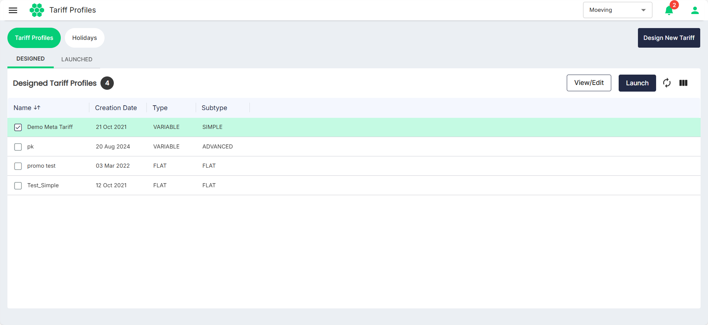
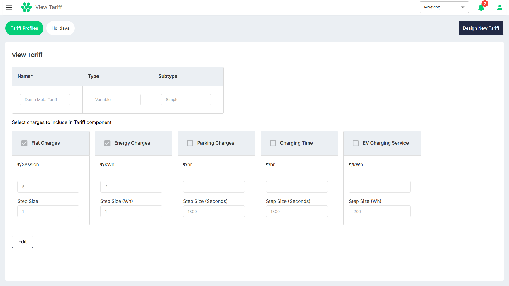
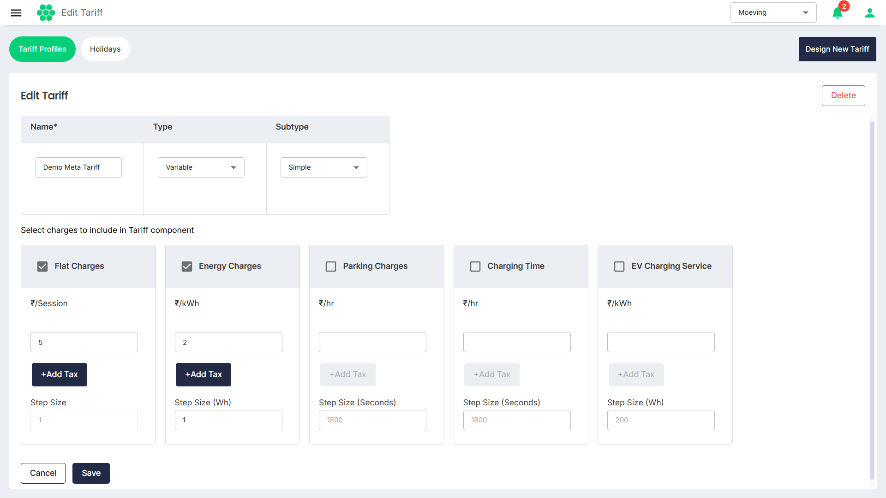

# Editing Tariff Profile
To edit an existing tariff profile, follow these steps:
1. Navigate to **Tariff** > **Tariff Profiles**. The following screen appears:
   
2. Under Designed Tariff Profiles, select the tariff you want to edit.
3. Click the **View/Edit** button. The following screen appears:
   
2. Click the **Edit** button.
   
3. Make the desired changes, and click **Save**.
