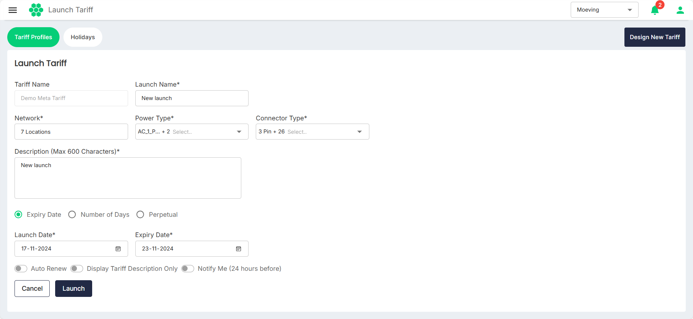
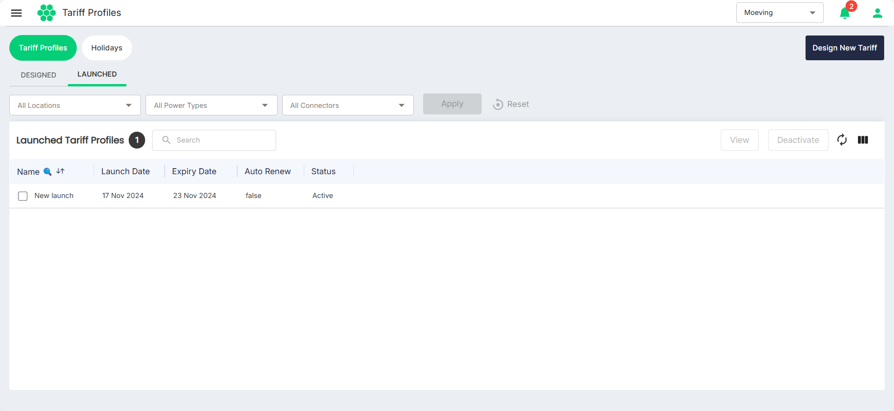
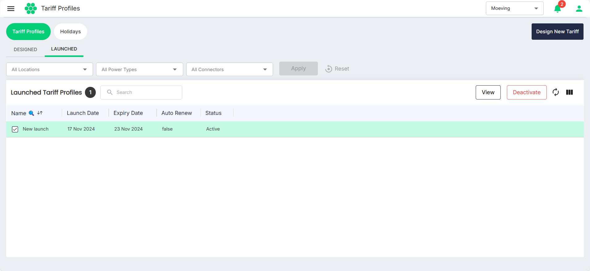
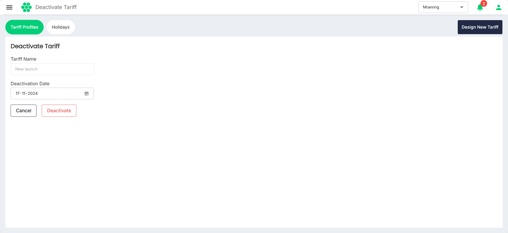

# Launching a Tariff Profile
Launching a tariff profile refers to the process of activating a predefined tariff for use at one or more EV charging stations. This step involves making the tariff profile operational so that it governs the charging costs for users interacting with those stations. 

To launch a tariff profile, follow these steps:
1. Navigate to **Tariff** > **Tariff Profiles**. The following screen appears:
   

3. Under Designed Tariff Profiles, select the tariff you want to launch.
4. Click the **Launch** button. The following screen appears:
   
4. Provide the following details:
	1. **Launch Name**: Provide a unique and descriptive launch name for the new tariff setting.
	2. **Network**: Choose the locations where the new tariff must be implemented.
	3. **Power Type** and **Connector Type**: Select the power type and connector type to precisely tailor the tariff to the specifications of the charging infrastructure.
	4. **Description**: Enter information for reference.
	5. **Choose Tariff Period:** Select the period for which the tariff should be in place. The following options are available:
		- **Expiry Date:** Set an expiry date for the tariff. The tariff will be implemented from the Launch Date until the specified Expiry Date.
		- **Number of Days:** Specify the number of days for which the tariff will be active. The tariff will be implemented from the launch date until the defined number of days elapse.
		- **Perpetual:** Opt for a perpetual tariff, which remains active until a new tariff is launched or the existing tariff is deleted.
5. Click **Launch**.

The  Designed Tariff Profile moves to the Launched Tariff Profiles section.

## Deactivating a Tariff Profile
To deactivate a tariff profile, follow these steps:
1. In the Launched Tariff Profiles section, select the tariff you want to deactivate.
   

3. Click the **Deactivate** button. The following screen appears: 
	
1. Select the **Deactivation Date**.
2. Click on the **Deactivate** button.