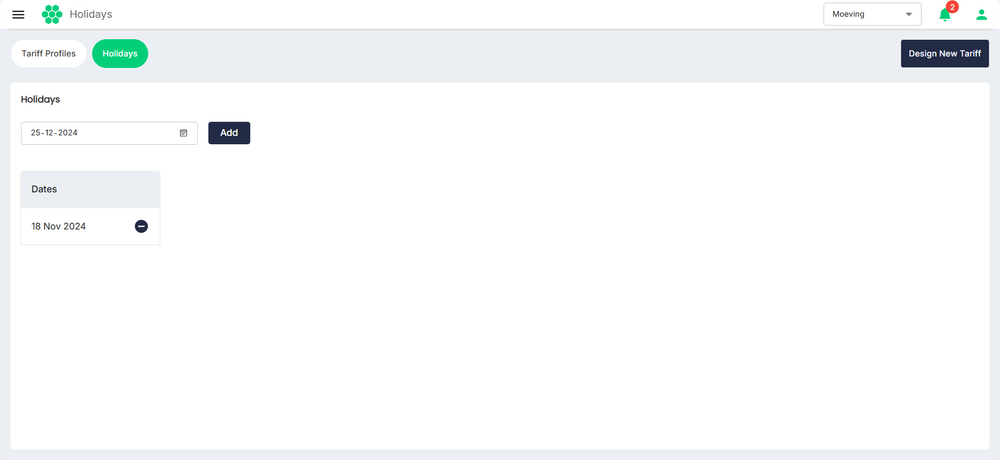
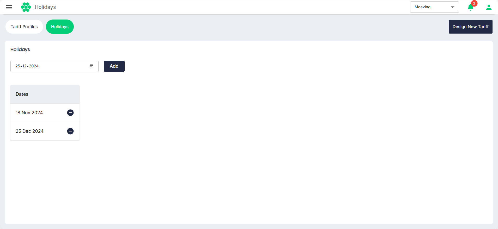
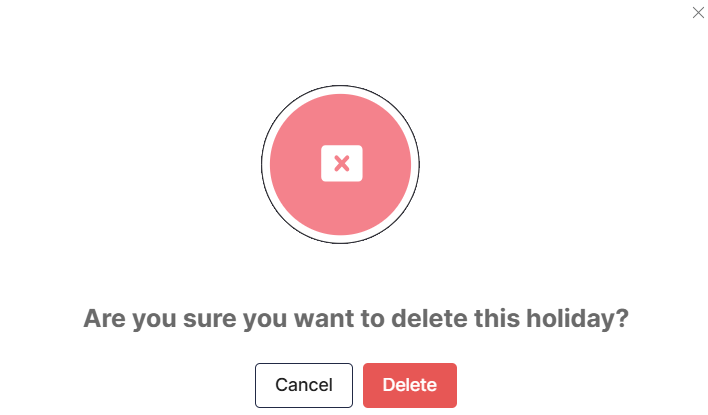

# Managing Holidays
Holidays refer to specific dates or periods when charging station may not be functional because of public holidays, special events, or operator-defined non-working days. 
## Adding a Holiday
To add a holiday, follow these steps:
1. Navigate to **Tariff** > **Holidays**. The following screen appears:
   
2. Select a date that you want to add as a holiday, and click Add. The date gets added below.
   
## Deleting a Holiday
To delete a holiday, follow these steps:
1. Navigate to **Tariff** > **Holidays**. The following screen appears:
   
2. Click on the delete icon  . The following screen appears:
   
3. Click on the **Delete** button to confirm.